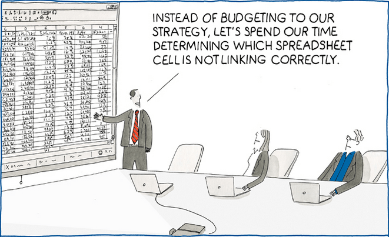

# Tidy Data

> “Hey, Mom, remember we had that conversation about trying to cut back on things that aren’t necessities?” - Michael Bluth

Tidy data refers to having your data organized in a specific manner suitable for analysis.  This chapter will walk through common problems and approaches to cleaning and tidying your data. Keeping your data in a tidy format for analysis will help because it is a fundamentally flexible way of working with data. Keeping scattered, lose data in spreadsheets is a sure way to cause confusion for yourself and others. 



*Image courtesy of [hive9.com](https://www.hive9.com/blog/just-say-no-to-spreadsheets)

## The Grammar of Tidy Data^[Adapted from Hadley Wickham's paper on [Tidy Data](https://vita.had.co.nz/papers/tidy-data.pdf)]

Democratic data analysis has an underlying structure, like a sentence. Rules exist so sentences (hopefully) make sense to you, the reader. Similarly, by following common conventions of democratic data analysis, others will be able to "read" your analysis like you are reading this sentence. And also, like grammar, you can and should break the rules-- but it helps to know them first. 

Here are a couple definitions that will help as you move through this text. Don't worry about memorizing them, as I will refer back to these definitions frequently. 

### Fields

A field is a fancy name for a column. 

From here on out, **every calculation, manipulation, formula, will be operated on a field**. 

I want you to forget that you could ever modify a lonely cell in Excel. No more formulas in cells. No more typing in values to a cell. Certainly no more writing over data in a cell. And for the love of eveything that is good, no more color coding cells. Democratic data analysis depends on formulas that work on entire fields. Everything you would need to do to a single cell in Excel can-- and should!-- be done to an entire column.  This may sound extreme and restrictive, but this approach will pay big dividends in your democratic data analysis journey and ultimately allow you to be more creative in your analysis. 

### Variables

A variable is something in your data that can change. That's it! Variables become very important when looking at how to structure your data. Each variable should have its own field (column).

### Observations

Observations make up the rows of your data set. Each observation should correspond to a specific "thing." This will make more sense later, I promise. 

### Values

Values are the actual data in your table. 

Each value belongs to 1 (one) (uno) observation and 1 (one) variable. That's it. 

This means, among other things, no more merged cells, merged rows, or groups. A one-to-one relationship between fields and observations is critical for getting the most out of your data analysis. 

### Tables

A table is the grouping of all observations of a similar type. 

The table sets the foundation for analyzing your data. **If I could only convince you of one thing, it would be the value in keeping your data in a table-based excel format**. If you are trying to do math or statistics (again, not data anlysis. These things are different!), then the table based framework can sometimes fall short. But if you are concerned with working with data to draw conclusions, then tables are the way to go. 

You may already be able to see how these definitions foreshadow some of what is coming in later sections. For example, there are no references to cells. This is intentional. The most important distinction between democratic data analysis and simply working in excel is that in democratic data analysis, (virtually) *everything* is done on the `field` level. Changes are made to entire columns, calculations are made on entire columns. Thinking in `fields` is the first step on the path to democratic data enlightenment. Having data formatted in the structure outlined above forces good data hygiene that will be very helpful later on when discussing reproduciblity and pivot-ability. 

## Cleaning and Tidying

I hate cleaning, but love tidying. Unfortunately, as in with life, one must clean before one tidies. But let's start with some conceptual definitions. 

Cleaning refers to the process of scrubbing the data into a way that makes sense to you, the analyst. Oftentimes, and especially in public sector organizations, the data is not clean. Whether you are looking at the output of a Survey Monkey survey or a canned report that is run from the IT department, your data will come in all shapes and sizes. Cleaning data is the process of transforming data values into ones that make sense for the purposes of your analysis. 

Here is the first major departure from what you may have been taught about data analysis in Excel. When you get messy data *do not* change individual cell values. Recall from the introductory chapter the difference between cells and fields. Fields, as a reminder, are columns that represent one variable. Use data analysis tools to make changes to the entire field, rather than specific cells. 

Most data analysis software, outside of Excel, make it difficult or impossible to change individual cell values. At first glance, this can seem unnecessary, limiting, and supremely annoying. But it's actually very helpful. Thinking in terms of fields, and making changes to entire fields, will save you *a lot* of work and  headache in the long run. 

Let's look at a sample dataset that may be similar to one you would encounter in real life. Here is a survey collected by a field manager of a local parks and recreation department on employment. 

```{r dirty-data, message=FALSE, warning=FALSE, echo=TRUE}
library(tidyverse)
library(DT)

sites <- tribble(
  ~"Employee", ~"Location", ~"Telecommute?", ~"Hire Date",
  "ron swanson", "Pawnee City Hall", "never", "Unknown",
  "Knope, Leslie", "Field Duty", "1 day/week", "2011-6-1",
  "Andy Dwyer", "sullivan street pit", "40 hours", "March 1, 2013",
  "Jerry Gergich", "City Hall", "never", "6/1/1985",
  "Garry Gergich", "City Hall", "never", "6/1/1985",
  "ben wyatt", "Partridge, Minnesota","" , "Jan. 1, 2010"
)

sites %>% datatable(
    extensions = 'Buttons', 
    options = list(dom = 'Bfrtip', 
                   buttons = 'excel',
                   searching = FALSE))
```

In this example, it would be trivial to go in to the Excel file and clean up the dates, names, and locations by hand. However, you could imagine this survey replicated for a department of forty employees. It quickly becomes unfeasible to make those edits by hand. When this is the case, there are functions in Excel and R that will make your life much easier. 

Here is annotated code for how I would go about cleaning this table in R. The friendly syntax of the `tidyverse` packages makes it easy to follow along, even if you aren't comfortable writing it yourself. You can accomplish all these similar transformations using [Get & Transform in Excel](https://support.microsoft.com/en-us/office/power-query-101-008b3f46-5b14-4f8b-9a07-d3da689091b5). 

```{r}
#creating a new table called "sites_cleaned", starting with the old table "sites"
sites_cleaned <- sites %>% 
  #switching the order of names that are backwards
  mutate(Employee = if_else(Employee == "Knope, Leslie", "Leslie Knope", Employee)) %>% 
  #seperate employee names into two columns
  separate(Employee, into = c("first_name", "last_name")) %>% 
  #renaming column names to standard format
  rename(location = Location,
         telecommute_hours =`Telecommute?`,
         hire_date = `Hire Date`) %>% 
  #changing first and last names and locations to Title Case
  mutate(first_name = str_to_title(first_name),
         last_name = str_to_title(last_name),
         location = str_to_title(location)) %>% 
  #coding location data to three categories, In Office, In Field, or Other
  mutate(location = case_when(
           str_detect(location, "City Hall") ~ "In Office",
           str_detect(location, "Field") ~ "In Field",
           str_detect(location, "Street") ~ "In Field",
           TRUE ~ "Other"),
  #coding hours to numeric
         telecommute_hours = case_when(
           telecommute_hours == "never" ~ 0,
           telecommute_hours == "1 day/week" ~ 8,
           telecommute_hours == "40 hours" ~ 40
         )
         )

#print to datatable
sites_cleaned%>% datatable(
    extensions = 'Buttons', 
    options = list(dom = 'Bfrtip', 
                   buttons = 'excel',
                   searching = FALSE))
  
  
```

This may seem like a lot of work for a small table. But as your data grows, it is much easier to operate on entire fields at a time. This is especially true in Get & Transform, which makes it very easy to transform and clean data using all the same steps as the `R` code above. As you can see, our table is now "cleaned" and organized consistently.


## Tidying
Tidy data is the way your data should be organized before you begin your analysis. In tidy data, each column is a *variable*, each row is an *observation*, and each table is an *associated set of observations*. What does that mean in practice? Consider the following example. 

Below is a table^[Data was created for demonstration purposes] that shows types of retirement visits for a month at a state's Department of Retirement Services by the employee who took the visit and the visit type. 

```{r tables-visits, message=FALSE, warning = FALSE, echo=TRUE}
#build sample data table
visits <- tribble(
  ~"Employee", ~"Phone Visits", ~"Office Visits", ~"Online Visits",
  "Danielle", 6, 11, 23,
  "Ramona", 11, 5, 18,
  "Ross", 10, 10, 10 
)

#print to datatable
visits%>% datatable(
    extensions = 'Buttons', 
    options = list(dom = 'Bfrtip', 
                   buttons = 'excel',
                   searching = FALSE),
                   caption = "Visits to the Dept. of Retirement Services in a given month by employee"
                   )

```

Data are frequently displayed in this "wide" format. It works great for presentation, but not great for data analysis. 

The shortcomings of data in this format may become apparent when you attempt to work with the data in a pivot table. This is because our columns aren't truly variables. Remember, variables are elements of an observation that can change. You can drag the fields from the top row to the grey box below, for columns, and the left, for rows. This becomes unmanageable quickly. 

```{r}
rpivotTable::rpivotTable(visits, width = "60%", height = "60%")
```


## Tidy Data- From Wide to Long


Let's apply our criteria of tidy data to this set:

* Variables
    * At first glance, it doesn't look like this is a problem. But think again. Is `phone visits` really a variable? Or is the real variable of interest number of visits? And are our column names are actually variables too (type of visit)? 
    

Let's take another swing at setting up our table for data analysis purposes. This can be accomplished easily in R using the code below, or in Excel by loading the data with [`Get and Transform`](https://support.microsoft.com/en-us/office/unpivot-columns-power-query-0f7bad4b-9ea1-49c1-9d95-f588221c7098) -> selecting the three "visits" columns -> right clicking -> and selecting "unpivot columns."

```{r}
#We have already loaded the "tidyverse" library so we do not have to do it again
#we are editing the "visits" table already created by storing it in a new table pivot_visits
pivot_visits <- visits %>% 
  #using pivot_longer on every column except "employee" and setting the name of the new columns
  pivot_longer(-Employee, names_to = "Visit Type", values_to = "Number of Visits") 


knitr::kable(pivot_visits, caption = "Visits to the Dept. of Retirement Services in a given month")
```

Now this is a table that is much easier to analyze in an Excel pivot table or with a variety of R functions. However, it does look worse and is less intuitive for human readers. Thankfully, using data in this format, it is easy to recreate the original table for presentation, while also giving a variety of options for formatting and plotting. Use the pivot table below to recreate the original table using the tidy data. *Hint- Instead of Count, select Sum -> Number of Visits as the value field. It is far easier to work with fields when they are in a tidy format. 

## Using lower level data

Let's introduce a slightly more complicated tidy data problem, using the same base data as before. 

```{r}
visits_retirements <- tribble(
  ~"Employee", ~"Phone Visits", ~"Phone Retirements", ~"Office Visits", ~"Office Retirements", ~"Online Visits", ~"Online Retirements",
  "Danielle", 6, 4, 11, 8, 23, 15,
  "Ramona", 11, 7, 5, 3, 18, 15,
  "Ross", 10, 8, 10, 7, 10, 9 
)

knitr::kable(visits_retirements, caption = "Visits to the Dept. of Retirement Services in a given month by employee and associated client retirements")
```

Hopefully you will see a similar pattern here. Now, there are three variables: Visit type, number of visits, and number of retirements. Again, this data works fine for presentation but could use tidying to ease in analysis. 

```{r}
visits_retirements %>%
  DT::datatable(
    extensions = 'Buttons', 
    options = list(dom = 'Bfrtip', 
                   buttons = 'excel',
                   searching = FALSE))
```

Try to tidy this in R or Excel Get and Transform. See this footnote^[powerquery hints] or look at the code if you need a hint. 


```{r}
visits_retirements_tidy <- visits_retirements %>%
  pivot_longer(cols = -Employee, 
               names_to = c("Visit Location", "Type"), 
               names_sep = " ")

print(visits_retirements_tidy)
```
In this case, we actually pivoted too far. It will probably be more useful to have the counts of visits and retirements in their own category. Keep in mind the scope of the observation-- It is perfectly valid for each to have their own column, as it is visits and retirements per month. 

```{r}
visits_retirements_tidy2 <- visits_retirements_tidy %>% 
  pivot_wider(id_cols = c(Employee, `Visit Location`, Type), names_from = Type, values_from = value)

print(visits_retirements_tidy2)
```

From here, it is easy to do calculations based on fields, rather than cells. For example, in R or Get and Transform, you could add the following:

```{r}
visits_pct <- visits_retirements_tidy2 %>% 
  mutate(pct_retirements = Retirements / Visits)

print(visits_pct)
```


And then, one of the most useful things you can do is develop formulas by grouping of rows. For example, you may want to know the total number of visits and retirements by retiree, regardless of visit location. That can be accomplished in a pivot table, which we will cover in the next section. 


## How is this democratic?

 Thinking of your analysis in terms of tidy data is the first step on your way to democratic data analysis. 

## Conclusion


## Practices/Resources

  