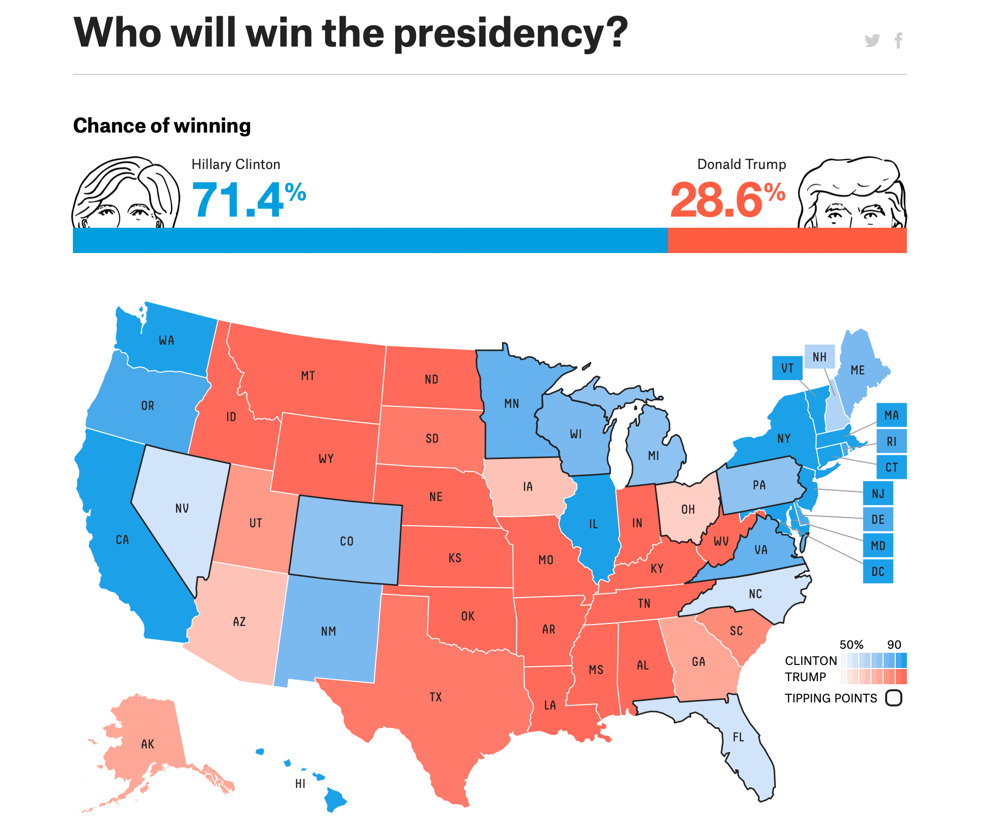
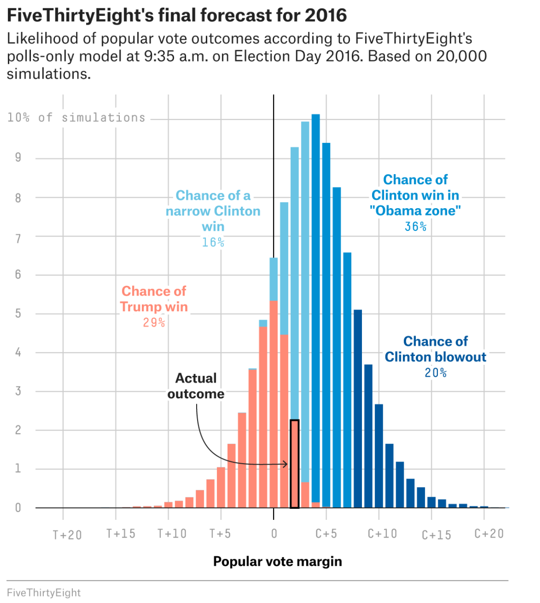

# Uncertainty Oriented Analysis 

> *“I mean its one banana Michael. What could it cost, $10?”*- Lucille Bluth

> *All models are wrong, but some are useful*-- George Box

> *A person with a watch knows what time it is. A man with two watches is never sure*- Segal's Law

## Embracing Uncertainty for Better Outcomes

What is the point of data analysis? Often, it is to use data to summarize the world around you. In a sense, all data analysis is model building, and by definition, a model is a simplified version of the world. Any time the analyst is using data analysis to inform decision making, she is in a sense making a model. Models are commonly thought of to provide answers to the question at hand. Model building, and data analysis more generally, never gives you "the" answer. Data analysis only gives you a answer, if it gives you an answer at all. If you have been following along to this point, you have learned the value of data analysis that is structured and built up, not out. Frequently, data analysis is valuable because it tells you what isn't the answer. As in the quote above, knowing the difference between the watches tells you something important. One watch doesn't tell you what you don't know^[adapted from [Statistical Modeling, by Daniel T Kaplan](https://dtkaplan.github.io/SM2-bookdown/introduction.html.  Knowing how to build uncertainty into your analysis is incredibly valuable as analysis -- models-- are used to implement important policies that impact the public good. Incorporating uncertainty into your analysis will make you both more credible and force you to use your subject matter expertise in addition to your data skills. 

## What is a Model?

A model is anything that is used to represent the world. By definition, anything that represents the world simplifies it, becuase the world is vastly complex. An average value of a dataset is a model. Same with the median, mode, and the other so-called *descriptive statistics* that you may be familiar with. 

When you create a data model, you bring all your expertise, subjectivity, and creativity to the table. Data modeling can 

Models transform data into decision making. Models are useful exactly because they are wrong! Because models are wrong, we can critically examine the wrong-ness of them to inform decisionmaking in a way that embraces uncertainty. 

## Examples of Models in the Public Sector

## Incorporating Uncertainty Into Models

## Example two

## Use Assumptions, and Document Them

By clearly documenting your assumptions, you allow them to vary as your understanding changes. 

## Practices

Talk about modeling implies math or statistics, when it really doesn't. All a model seeks to do is to simply phenomena in a manner that can be comprehended and used to make decisions in conjunction with subject matter expertise. 